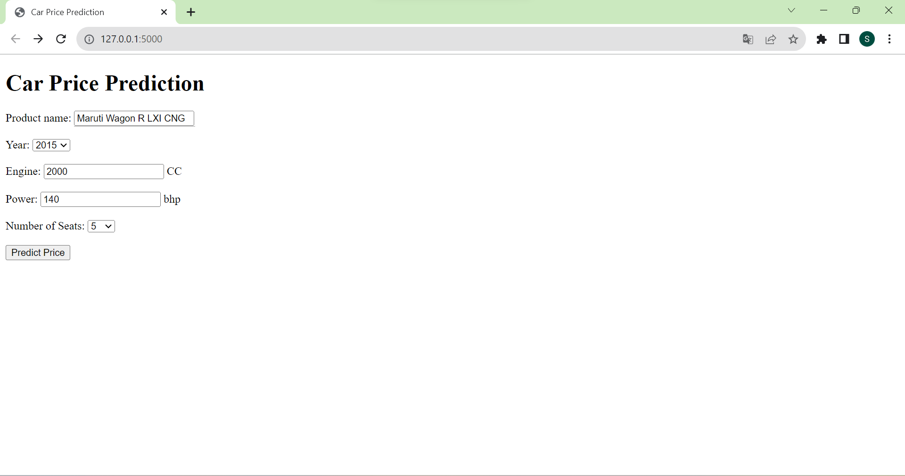
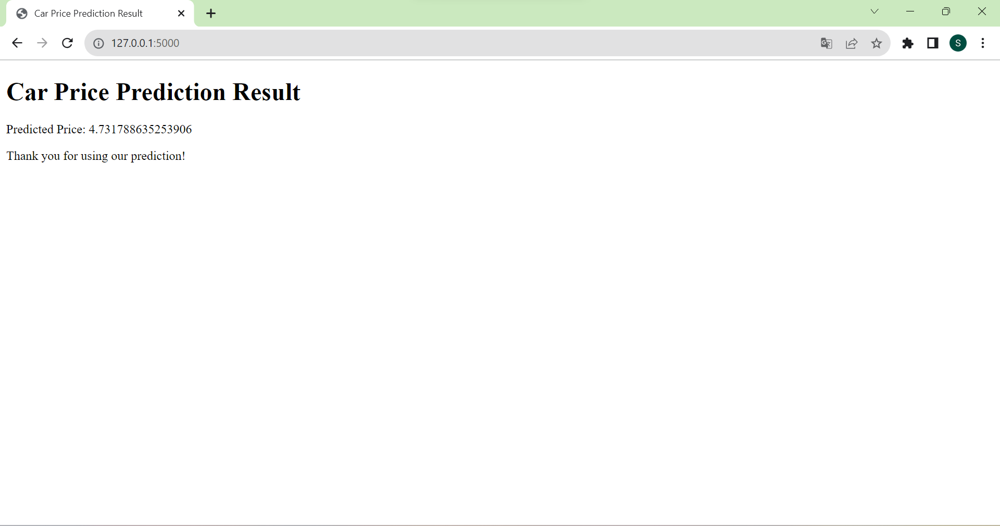

# 🚗 Predict Car Price with LassoCV
This project focuses on predicting car prices using two machine learning models: Lasso Regression and Decision Tree Regression. The goal of this project is sử dụng mô hình hồi quy Lasso với Cross Validation để dự đoán giá của xe đã được xử dụng.

## Dataset
You can download this dataset in [**kaggle**](https://www.kaggle.com/datasets/avikasliwal/used-cars-price-prediction).

The dataset used for this project contains information about different cars, including variables such as `Name`, `Location`, `Year`, `Fuel_Type`,	`Engine`, `Seats` and other relevant features. It also includes the corresponding price of each car. This dataset is used for training and evaluating machine learning models.

## Installation and Setup
Clone the repository: 
```shell
git clone https://github.com/hasonsk/predict-car-price-Lasso.git
```


Move to the project directory: 
```shell
cd predict-car-price-Lasso
```

Install the required libraries: ```pip install -r requirements.txt```

To deploy and run app: 
```shell
flask run
```

## Usage
1. Import Libraries and Data
Ensure you have the necessary libraries installed and load your dataset using the pd.read_csv() function.

2. Clean Data and Remove Outliers
Clean the data by handling missing values, removing outliers, and processing text data as needed.

3. Split Data into Training and Testing Sets
Use the `train_test_split()` function to split your dataset into training and testing sets for model evaluation.

4. Train the Model
Initially, you can start with Linear Regression, but if you encounter significant errors, consider using LassoCV to find the optimal alpha coefficient that minimizes the R-squared.

5. Save and Run the Model on Test Data
Save the trained model and apply it to your test dataset for predictions.


## Model
### LassoCV Regression Model

The LassoCV model combines Lasso regression with cross-validation to automatically select important features and find the best regularization parameter (alpha) for linear regression. It helps simplify models and reduce overfitting, making it a valuable tool in machine learning and data analysis.

## Deployment

### Here is a sample image demonstrating the usage of the API. Feel free to try it out and explore, you might find it excited! 




#### 😄 I am very grateful for receiving your feedback and contributions!!!